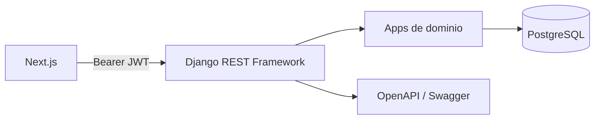

# Arquitectura

El frontend Next.js consume la API REST Django en `/api`. Django REST Framework valida JWT, permisos y datos; PostgreSQL 17 persiste el estado. Docker Compose coordina la API y la base en desarrollo.

| App | Responsabilidad |
|---|---|
| `accounts` | Registro, login, refresh JWT y onboarding. |
| `content` | Posts, calendario y dashboard. |
| `ideas` | Ideas persistidas y generador local. |
| `insights` | Generación/mejora local y analytics. |
| `integrations` | Estado e inicio OAuth. |
| `common` | Errores API consistentes. |

La IA actual es local y determinista. LinkedIn, sincronización externa, Redis y tareas en cola no están implementados; no deben asumirse como capacidades operativas.
