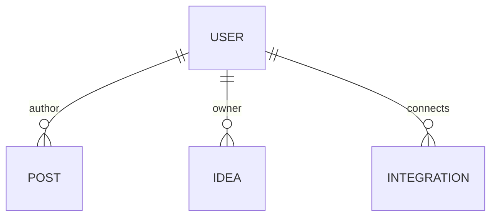

# Modelo de datos

Las claves de negocio son UUID y las fechas se exponen en ISO 8601.

## Usuario

`accounts.User` autentica por email único y almacena nombre, avatar, profesión, tecnologías, objetivo, tono, idioma, frecuencia y estado del onboarding. Django hashea las contraseñas.

## Publicación

`content.Post` pertenece a un autor. Incluye contenido (máximo 3000 caracteres), estado (`draft`, `scheduled`, `published`), fechas, tono, tipo, fuente y métricas. Un post `scheduled` exige una fecha futura.

## Idea

`ideas.Idea` pertenece a un usuario e incluye título, descripción, categoría, hasta diez etiquetas y estado de guardado.

## Integración

`integrations.Integration` es única por usuario y proveedor (`github`). Expone estado, nombre externo y fecha de conexión.

